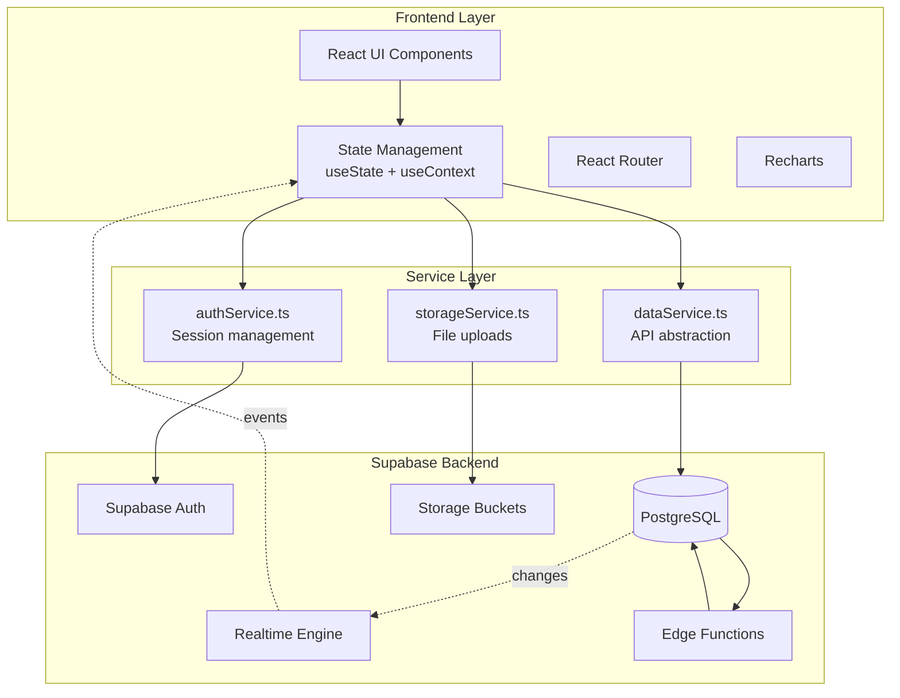
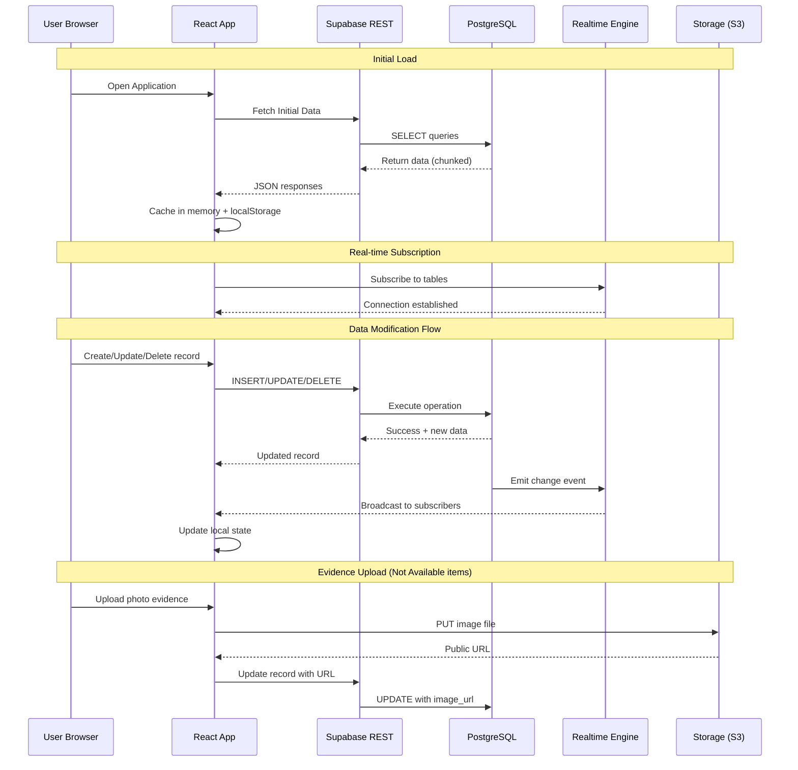
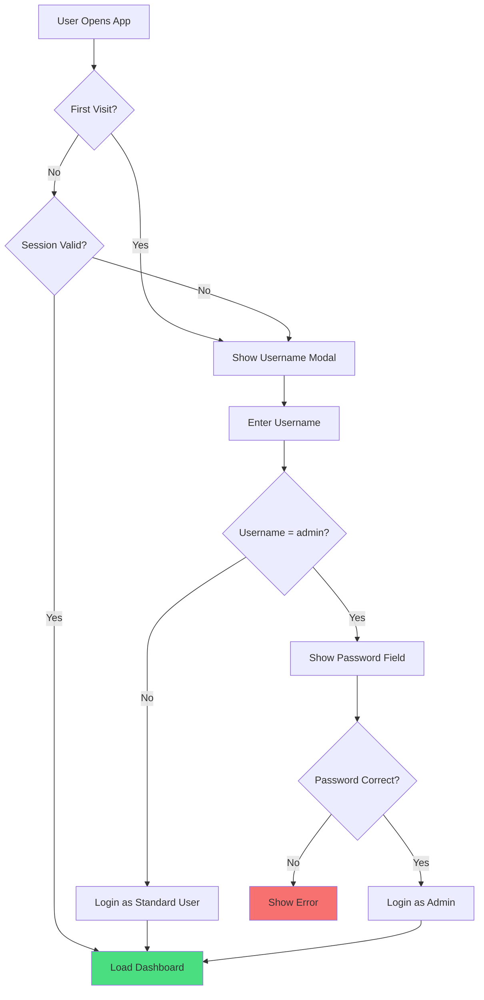

# GRP Slab Opname System

<div align="center">
  <h1>🏭 GRP Slab Opname System</h1>
  <p><strong>Real-time inventory monitoring and slab stock reconciliation for PPIC</strong></p>
  <p>
    
    
    
    
    
  </p>
</div>

---

## 📋 Overview

**GRP Slab Opname** is a comprehensive web-based application designed for PPIC (Production Planning and Inventory Control) teams to perform real-time slab stock reconciliation. The system enables multiple users to conduct physical inventory counts simultaneously with instant synchronization across all connected clients.

### Key Capabilities

| Feature | Description |
|---------|-------------|
| **Real-time Sync** | Instant updates across all connected clients via WebSocket |
| **Opname Matrix** | Visual inventory grid for quick status assessment |
| **Evidence Capture** | Photo documentation for missing/unavailable items |
| **Role-based Access** | Admin and User roles with appropriate permissions |
| **Data Management** | CSV import/export, backup/restore functionality |
| **Lock Mode** | Freeze system during processing periods |

### Core Modules

- **Dashboard** - Real-time stock overview, recent activity feed, online users tracking
- **Opname Slab** - Search and filter slabs, matrix display, submit findings (Sync/Missing/Not Available)
- **Opname List** - Historical records with filtering, pagination, and CSV export
- **Settings** - Location management, user management, session control
- **Database** - Master data management, backup/restore, CSV import

---

## 🏗️ System Architecture



---

## 🔄 Real-time Data Flow



---

## 👤 User Authentication Flow



---

## ✨ Key Features

### 🔍 Smart Search & Matrix
- Instant slab lookup across SAP, Mother Slab, and Cut Stock databases
- Visual matrix showing all matching records with weights and dimensions
- Duplicate detection with fuzzy matching warnings

### 📸 Evidence Collection
- Camera integration for "Not Available" item documentation
- Automatic image upload to Supabase Storage
- Evidence gallery linked to each record

### 🔒 Security & Control
- Admin-only lock mode to freeze system during critical periods
- User session management with real-time online status
- Kick/remove user capability for administrators

### 💾 Data Integrity
- Chunked operations for large datasets (1000 records per batch)
- Automatic backups with restore capability
- CSV import with auto-delimiter detection

---

## 🛠️ Tech Stack

| Layer | Technology | Purpose |
|-------|------------|---------|
| **Frontend** | React 18 + TypeScript | UI Components |
| **Build Tool** | Vite 6 | Fast bundling & HMR |
| **Styling** | Tailwind CSS 3 | Utility-first CSS |
| **Backend** | Supabase | PostgreSQL + Auth + Storage |
| **Realtime** | Supabase Realtime | WebSocket subscriptions |
| **Icons** | Lucide React | Icon library |
| **Charts** | Recharts | Dashboard visualizations |

---

## 🚀 Getting Started

### Prerequisites

- **Node.js** v18 or higher
- **Supabase Project** with configured database and storage

### Installation

```bash
# Clone the repository
git clone https://github.com/daniswaramp/grp-slab-opname.git
cd grp-slab-opname

# Install dependencies
npm install
```

### Environment Configuration

Create `.env.local` in the project root:

```env
# Supabase Configuration
VITE_SUPABASE_URL=your_supabase_project_url
VITE_SUPABASE_ANON_KEY=your_supabase_anon_key
```

### Database Setup

The application requires the following tables in Supabase. Run the SQL script in `components/DatabaseSetup.tsx` or create tables manually:

```sql
-- Core Tables Required:
- sap_stock         (Batch ID, Grade, Dimensions, Weight)
- mother_slab_stock (Batch ID, Grade, Dimensions, Weight)
- cut_slab_stock    (Batch ID, Grade, Dimensions, Weight)
- opname_records    (Main opname entries)
- locations         (Warehouse locations)
- users_online      (Active user sessions)
- system_settings   (Lock state, notifications)
- opname_backups    (Backup storage)
```

### Storage Setup

1. Create a storage bucket named `Slab_Opname`
2. Configure RLS policies for public read access
3. Enable Realtime for all tables in Supabase Dashboard

### Development

```bash
# Start development server
npm run dev

# Build for production
npm run build

# Preview production build
npm run preview
```

---

## 📁 Project Structure

```
├── components/          # React UI components
│   ├── Dashboard.tsx   # Main dashboard view
│   ├── OpnameSlab.tsx  # Slab opname entry form
│   ├── OpnameList.tsx  # Historical records view
│   ├── Database.tsx    # Import/export tools
│   └── ...
├── services/           # Data service functions
│   └── dataService.ts # Supabase API abstraction
├── migrations/         # SQL migration scripts
├── command/           # SQL Editor commands
├── docs/              # Design specifications
├── types.ts           # TypeScript interfaces
├── supabaseClient.ts  # Supabase client config
└── App.tsx            # Main app component
```

---

## 📊 Database Schema

| Table | Purpose |
|-------|---------|
| `opname_records` | Main opname entries with findings |
| `sap_stock` | SAP system stock data |
| `mother_slab_stock` | Mother slab inventory |
| `cut_slab_stock` | Cut slab inventory |
| `opname_backups` | JSON database snapshots |
| `system_settings` | Lock state, notifications |
| `users_online` | Active user sessions |
| `locations` | Warehouse configurations |

---

## 🔐 User Roles

| Role | Permissions |
|------|-------------|
| **Admin** | Full access: CRUD, import/export, backup/restore, user management |
| **User** | View records, submit opname findings, upload evidence |

---

## 📝 License

This project is proprietary software developed for internal use at GRP (Gunung Raja Paksi).

---

<div align="center">
  <p>Built with ❤️ for PPIC Operations</p>
</div>
